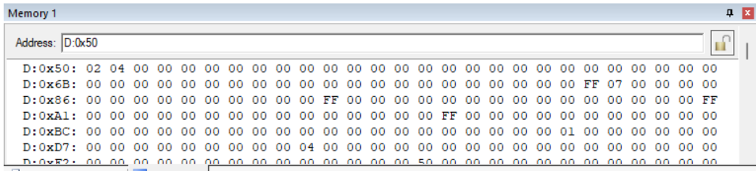
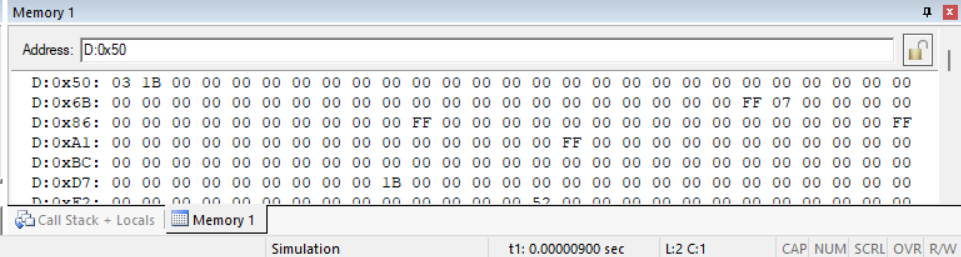

# Square-Cube-of-a-number-using-8051
# 8051 Square  Program

## AIM
To write and execute an Assembly language program for finding the square of a given data using 8051 microcontroller in Keil software.

## APPARATUS REQUIRED
- Personal computer
- Keil μVision IDE

## ALGORITHM
1. Enter the Assembly language program.
2. Provide the input value to Port 0 (P0).
3. Execute the program.
4. The output square value is stored in Port 2 (P2).

## PROGRAM
NAME - K SURYA
REG NO - 212225060282
```asm
ORG 0000H
MOV R0,#50H
MOV A,@R0 
MOV B,@R0 
MUL AB
INC R0 
MOV @R0,A
END

```

## OUTPUT





## RESULT
Thus, the square of the given data is calculated using 8051 Keil.

# 8051 Cube  Program

## AIM
To write and execute an Assembly language program for finding the cube of a given data using 8051 microcontroller in Keil software.

## APPARATUS REQUIRED
- Personal computer
- Keil μVision IDE

## ALGORITHM
1. Enter the Assembly language program.
2. Provide the input value.
3. Execute the program.
4. The output cube value is stored in a memory location.

## PROGRAM
NAME - K SURYA
REG NO - 212225060282
```asm
ORG 00H
MOV R0,#50H
MOV A,@R0
MOV B,A
MUL AB
MOV B,@R0
MUL AB
INC R0
MOV @R0,A
INC R0
MOV @R0,B
END

```


## OUTPUT





## RESULT
Thus, the cube of the given data is calculated using 8051 Keil.
